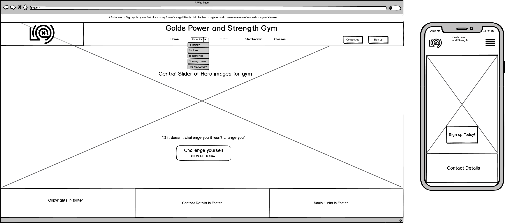
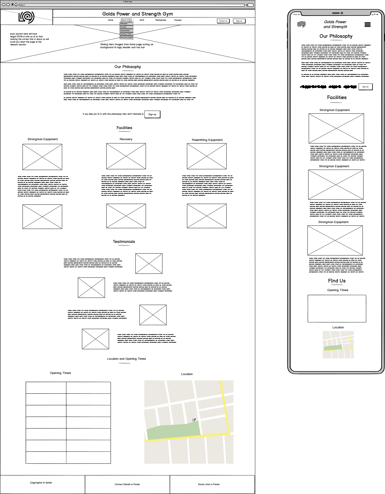
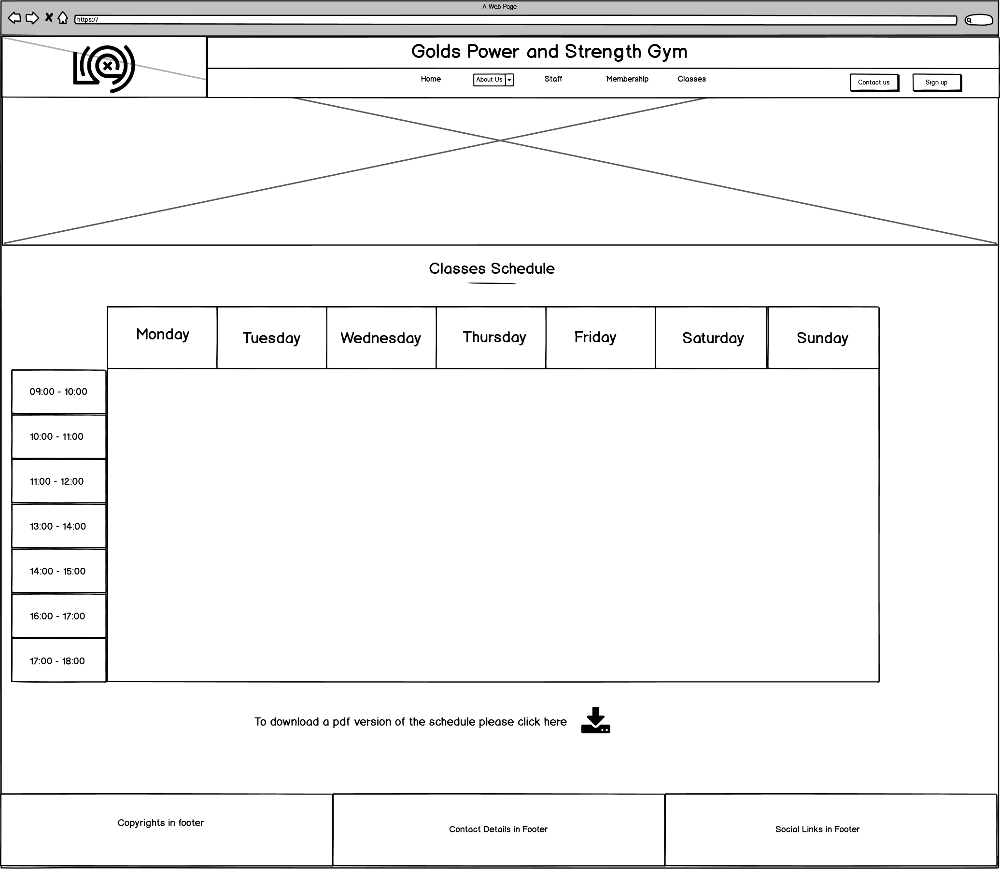
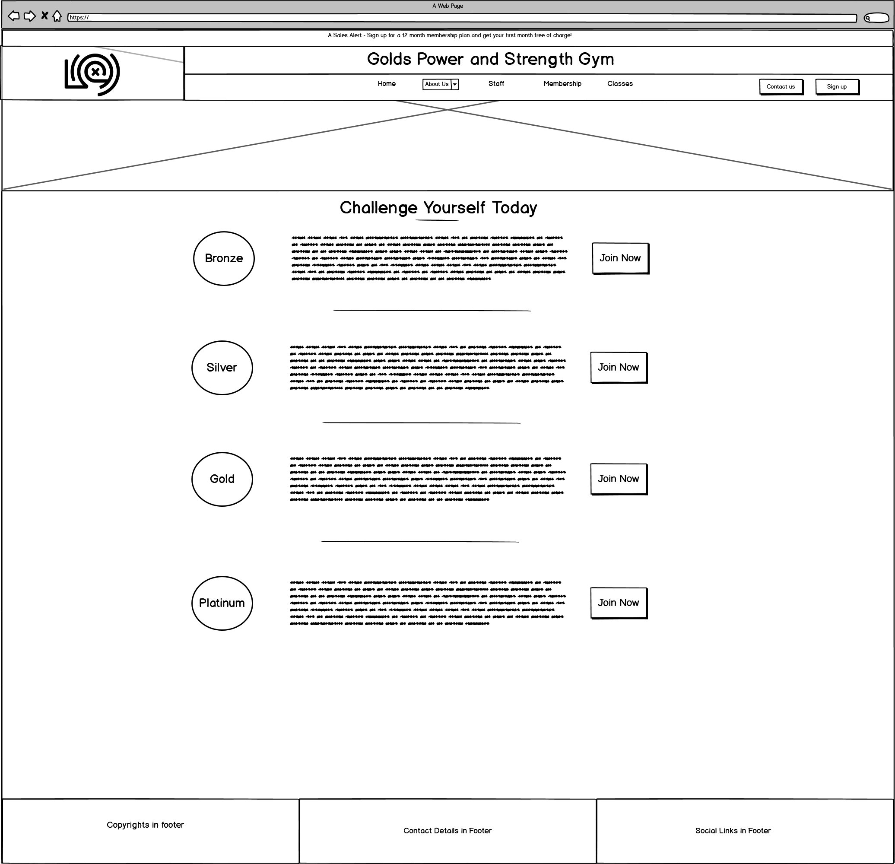

# Gold's Power and Strength Gym
The objective of this website is to advertise a specialist strength gym in order to attain new members and getting them to sign up to the gym using one of the four membership options. The website will highlight the different unqiue selling points of the gym which includes:
- It's access to specialist strongman equipment such as logs and atlas stones
- The highly qualified staff who have unqiue experience in the stregnth industry
- The availability of a wide range of classes and recovery facilities  

The website also introduces you to the philosophy of the gym which, alongisde testomonials and the staff desciptions, show that Gold's Gym is the place to train if you have any interest in progessing in strength sports.  

A live demo of the site can be found [here](https://johngc1510.github.io/milestone-proejct-1/index.html)

### **Business Goals**
- To generate revenue for the gym by recruiting more members.
- To build a stronger online presence for the gym.

### **Customer Goals**
- Finding a specialist gym with like-minded individuals
- Finding a gym to to begin training at
- Easy navigation on a mobile device if searching for a local gym whilst travelling
## UX
---
### **Ideal User**
- Anyone with an interest in strength sports
- Anyone looking for a new gym
- Anyone looking for personal development  
- Anyone looking to take their sport to the next level

### **User Stories**
1. As a new visitor I want the purpose of the website to be immediately clear
2. As a new vistor I want to know where the gym is
3. As a new visitor I want to know what to know previous users experience at the gym
4. As a new vistor/potential customer I want to know the opening hours of the gym
5. As a potential customer I want to know the cost of membership
6. As a potential customer I want to be able to easily sign up to the gym
7. As a potential customer I want to be able to easily contact the gym owners
8. As a potential customer I want to know what facilities and classes are available

### **Design Choices**

#### **Font**
I used the Roboto Slab font for my headers and the lato font for my body as it lead to a professional easy-to-read design 

#### **Icons**
I used Font Awesome icons for my social media links and for my download icon as it gives a intuitive way for users to access the sites social media.

#### **Colors**
The color scheme was entirely based around the colour of the logo - I used dev tools to get the exact hex colour of both the yellow background and grey text. 

#### **Sliding Hero Header**
I took influence from sites such as [RX Gym](https://www.rxgym.co.uk/) and [Gold's Gym](https://www.goldsgym.com/) where they had the navbar behind a hero image with a slogan.  
I very much liked this design idea and thought it immediately gave users the ability to identify the purpose of the website as well as looking professional.

#### **Testimonials Format**
When researching gym websites I liked the layout on [UFC Gym](https://www.ufcgym.com/classes/) with image/text text/image and decided to sue that layout to display my testomonials.

### **Wireframes**
#### Index Wireframe

#### About-Us Wireframe

#### Classes Wireframe

#### Staff Wireframe

#### Membership Wireframe

## Features
---
### **Existing Feautres**
- The website is responive on all device sizes.
- Modals are available that allow you to sign up to the site or contact the owner
- Navigaton bar fixed on mobile devices to allow for easy navigation

### **Differences from wireframes**
- Upon advice from mentor I moved the testimonial section from about-us to the index page to give more information about the site on the home page.
- Added cards of the individual classes to the classes page as it looked very bare with just a timetable. 

### **Features left to implement**
- Use JS to allow for the form to actually be submitted and back-end to allow for user-data to be stored.
- Add a feature to allow for members to login and to book a spot in the specific class

## Technologies Used
---
This project used the languages HTML5 and CSS3.

- [GitPod](https://gitpod.io/workspaces/) - The entire website was developed in GitPod
- [GitHub](https://github.com/) - GitHub was used to store the project and to deploy it using the master branch on the github site
- [Bootstrap](https://getbootstrap.com/) - The grid structure was used to structure the website and make it responsive and some default items in bootstrap were used as a starting point
- [FontAwesome](https://fontawesome.com/) - Font Awesome was used for the social media icons
- [unsplash] (https://unsplash.com/s/photos/gym) - Used for images

## Testing
---
### **Code Validation**
- All pages have been put through the [HTML validator](https://validator.w3.org/) and the [CSS validator](https://jigsaw.w3.org/css-validator/) to ensure no syntax errors - initially had comments with multiple dashes for spacing and had to replace 
  this with blank spaces to remove an error.

### **User Story Testing**
1. As a new visitor I want the purpose of the website to be immediately clear
    - Acheieved - the user first observes a hero image of a gym and a clear header and logo.
    - There is a slogan and prompt that encourage you to sign-up to the gym.
2. As a new vistor I want to know where the gym is
    - Acheived - easy to navigate to the location using the about-us dropdown menu.
3. As a new visitor I want to know what to know previous users experience at the gym
    - Acheived - A good series of tesitmonials are visible on the home page.
4. As a new vistor/potential customer I want to know the opening hours of the gym
    - Acheived - easy to navigate to the location using the about-us dropdown menu.
5. As a potential customer I want to know the cost of membership
    - Acheived - The membership pages clearly states the cost and benefits of the different membership types.
6. As a potential customer I want to be able to easily sign up to the gym
    - Acheived - sign up buttons are avilable on multiple site pages and on the membership page their is a seperate button for each type of membership
7. As a potential customer I want to be able to easily contact the gym owners
    - Partially Acheived - the contact button is available on all pages at all times in the header however not on mobile view as the button looked clunky and had no space on the navbar. Contact details can always be found in the footer.
8. As a potential customer I want to know what facilities and classes are available
    - Achieved - It is easy to navigate to the classes and facilities page which clearly demonstrate what is available at the gym.

### **Manual Testing**   
- Once the header had been created tested the responsiveness of it on a variety of device sizes using dev tools, I discovered that the h1 did not centre automatically. The initial layout used a col-2 to store the logo and the nav bar and h1 were
  stored in a col-10 in seperate rows; the h1 and nav bar centered in the col-10 and I could not center it in the row. I fixed this by adjusting the layout to col-2 col-8 col-2 and storing the contact us button in the final col-2. 
  This centred the layout across all devices.
-  Everytime I implemented a section I did similar tests and found on almost all pages I needed to add a large number of media commands to center images on small scale devices - using dev tools I discovered the issue was I had intially 
   forgotten to zero the padding and margin of the rows and columns which had an effect on the smaller devices. Setting these to zero fixed this issue.
- Tested all pages with images to ensure the images scaled down well and looked good across all device sizes. An issue was found with images on staff page on mobile devices; the issue was solved by changing the layout to prevent the images
  becoming squashed. 
- Site was tested on numberous devices, Huwawei P30 Pro, Google Pixel 3, Ipad Pro, Ipad, Desktop (4k monitor) and on a Chromebook.
- Site was tested by numberous family members and friends to try find errors. 

## Deployment
---
The site is hosted usig GitHub and has been deployed directly from the master branch. The master branch was the only branch used for this website.

## Credits
---
### **Code**
- [Bootstrap 4](https://getbootstrap.com/): Bootstrap library used throughout main project - used the cards template, the grid system, modals and the default slider with custom css.
- [Embedded Google Map](https://mdbootstrap.com/docs/jquery/javascript/google-maps/): Copied the code from this link to embedd the google map on my about-us page.
- [Dulled Slider Image](https://stackoverflow.com/questions/44463690/darkening-a-background-image-on-a-bootstrap-carousel) Used this thread to find the solution of how to add a transparent background to my slider for text contrast.
- The code institue mini projects for the resume and the whiksey project were also referenced on occasions

### **Media**
- All background images taken from [unsplash] (https://unsplash.com/s/photos/gym)
- Images of celebreties and people taken from respective wikipedia pages
- Gym logo used taken from [Gold's Gym](https://www.goldsgym.com/) - I own no rights to this image. 

### **Acknowledgements**
- My mentor Anthony Montaro for his fantastic support and assistance
- The slack community for their continued support
