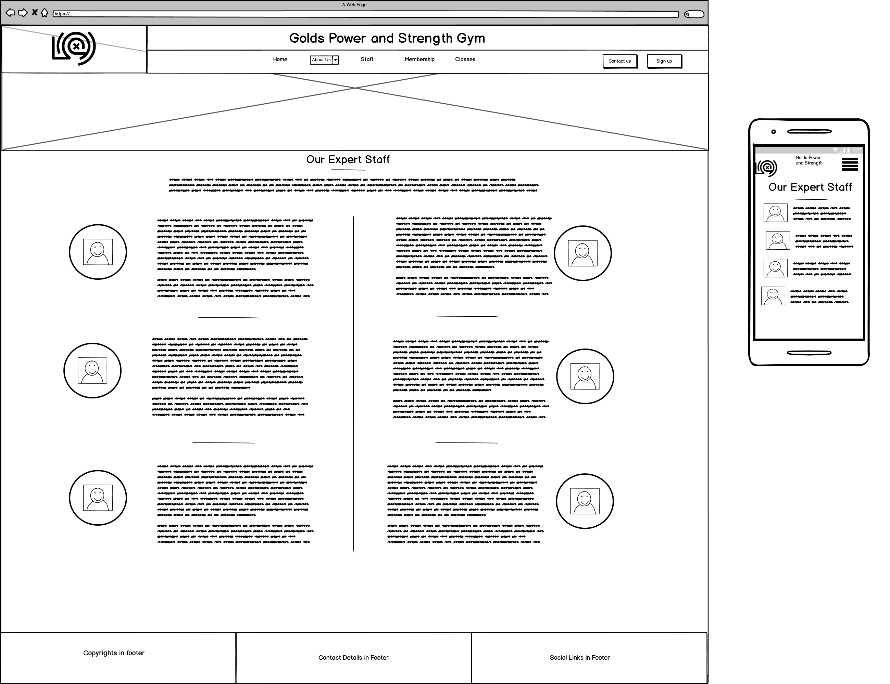

# Gold's Power and Strength Gym
The objective of this website is to advertise a specialist strength gym in order to attain new members and getting them to sign up to the gym using one of the four membership options. The website will highlight the different unqiue selling points of the gym which includes:
- It's access to specialist strongman equipment such as logs and atlas stones
- The highly qualified staff who have unqiue experience in the stregnth industry
- The availability of a wide range of classes and recovery facilities  

The website also introduces you to the philosophy of the gym which, alongisde testomonials and the staff desciptions, show that Gold's Gym is the place to train if you have any interest in progessing in strength sports.  

### **Business Goals**
- To generate revenue for the gym by recruiting more members.
- To build a stronger online presence for the gym.

### **Customer Goals**
- Finding a specialist gym with like-minded individuals
- Finding a gym to to begin training at
- Easy navigation on a mobile device if searching for a local gym whilst travelling
## UX
---
### **Ideal User**
- Anyone with an interest in strength sports
- Anyone looking for a new gym
- Anyone looking for personal development  
- Anyone looking to take their sport to the next level

### **User Stories**
1. As a new visitor I want the purpose of the website to be immediately clear
2. As a new vistor I want to know where the gym is
3. As a new visitor I want to know what to know previous users experience at the gym
4. As a new vistor/potential customer I want to know the opening hours of the gym
5. As a potential customer I want to know the cost of membership
6. As a potential customer I want to be able to easily sign up to the gym
7. As a potential customer I want to be able to easily contact the gym owners
8. As a potential customer I want to know what facilities and classes are available

### **Design Choices**

#### **Font**
I used the Roboto Slab font for my headers and the lato font for my body as it lead to a professional easy-to-read design 

#### **Icons**
I used Font Awesome icons for my social media links and for my download icon as it gives a intuitive way for users to access the sites social media.

#### **Colors**
The color scheme was entirely based around the colour of the logo - I used dev tools to get the exact hex colour of both the yellow background and grey text. 

#### **Sliding Hero Header**
I took influence from sites such as [RX Gym](https://www.rxgym.co.uk/) and [Gold's Gym](https://www.goldsgym.com/) where they had the navbar behind a hero image with a slogan.  
I very much liked this design idea and thought it immediately gave users the ability to identify the purpose of the website as well as looking professional.

#### **Testimonials Format**
When researching gym websites I liked the layout on [UFC Gym](https://www.ufcgym.com/classes/) with image/text text/image and decided to sue that layout to display my testomonials.

### **Wireframes**
#### Index Wireframe

#### About-Us Wireframe

#### Classes Wireframe

#### Staff Wireframe

#### Membership Wireframe

## Features
---

## Technologies Used
---

## Testing
---

## Deployment
---

## Credits
---
### **Code**
- [Bootstrap 4](https://getbootstrap.com/): Bootstrap library used throughout main project - used the cards template, the grid system, modals and the default slider with custom css.
- [Embedded Google Map](https://mdbootstrap.com/docs/jquery/javascript/google-maps/): Copied the code from this link to embedd the google map on my about-us page.
- [Dulled Slider Image](https://stackoverflow.com/questions/44463690/darkening-a-background-image-on-a-bootstrap-carousel) Used this thread to find the solution of how to add a transparent background to my slider for text contrast.
- The code institue mini projects for the resume and the whiksey project were also referenced on occasions

### **Media**
- All background images taken from [unsplash] (https://unsplash.com/s/photos/gym)
- Images of celebreties and people taken from respective wikipedia pages
- Gym logo used taken from [Gold's Gym](https://www.goldsgym.com/) - I own no rights to this image. 

### **Acknowledgements**
- My mentor Anthony Montaro for his fantastic support and assistance
- The slack community for their continued support
